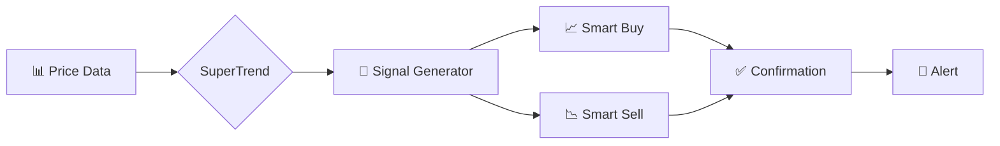

<div align="center">

# 🌆 QUENTRA ALGO 🌆
### *Advanced Multi-Timeframe Smart Signal Indicator*


---

[](https://github.com/QuentraAlgo)
[](https://www.tiktok.com/@quentraalgo)
[](https://www.instagram.com/quentraalgo)
[](https://x.com/quentraalgo)
[](https://www.threads.com/@quentraalgo)
[](https://www.facebook.com/quentraalgo)
[](https://youtube.com/@quentraalgo)
[](https://quentraalgo.my.id)

---

<p align="center">
  
</p>


</div>

---

## 🎯 OVERVIEW

**Quentra Algo** is a cutting-edge Pine Script indicator designed for **TradingView** that combines multiple technical analysis tools into one powerful smart signal system. Built with advanced algorithms for multi-timeframe analysis, trend detection, and risk management.

<div align="center">

```ascii
╔══════════════════════════════════════════════════════════════╗
║                    🚀 KEY FEATURES 🚀                        ║
╠══════════════════════════════════════════════════════════════╣
║  ⚡ Multi-Timeframe Analysis (M1, M5, M15, M30, 1H, 4H, D1) ║
║  🎯 Smart Buy/Sell Signals with SuperTrend Algorithm        ║
║  📊 Real-time Smart Dashboard                                ║
║  🌊 Trend Cloud & Cirrus Cloud Visualization                 ║
║  💎 Support & Resistance Zone Detection                      ║
║  🎲 Risk Management with TP/SL Areas                         ║
║  🔔 Customizable Alert System                                ║
║  🌈 Advanced Bar Coloring (Trend/Gradient)                   ║
╚══════════════════════════════════════════════════════════════╝
```

</div>

---

## 📦 INSTALLATION

### **Step 1: Access TradingView**

```bash
# Navigate to TradingView
🌐 https://www.tradingview.com
```

### **Step 2: Open Pine Editor**

```bash
# Click on "Pine Editor" at the bottom of the chart
📝 Pine Editor → New → Blank Indicator
```

### **Step 3: Copy & Paste**

```bash
# Copy the entire script code
# Paste into Pine Editor
# Click "Add to Chart"
```

<div align="center">


</div>

---

## ⚙️ CONFIGURATION

### **📊 Dashboard Settings**

| Parameter | Type | Description |
|-----------|------|-------------|
| `Show Smart Panel` | Boolean | Enable/Disable dashboard display |
| `Location` | String | Position (9 options available) |
| `Size` | String | Panel size (Tiny/Small/Normal/Large) |

### **🎯 Signal Settings**

| Parameter | Type | Default | Description |
|-----------|------|---------|-------------|
| `Show Signals` | Boolean | `true` | Display buy/sell signals |
| `Sensitivity` | Float | `2.0` | Signal sensitivity (1-20) |
| `Smart Signals Only` | Boolean | `false` | Filter for smart signals only |
| `Bar Coloring` | String | `Trend` | Gradient or Trend mode |

### **💰 Risk Management**

| Parameter | Type | Default | Description |
|-----------|------|---------|-------------|
| `TP/SL Areas` | Boolean | `false` | Show take profit/stop loss |
| `Distance` | Integer | `20` | Label distance |
| `Decimals` | Integer | `2` | Price decimals (1-8) |
| `Risk %` | Integer | `1` | Risk percentage |
| `ATR Length` | Integer | `14` | ATR calculation period |

### **🎨 Indicator Overlay**

```yaml
Features:
  - 🌥️ Trend Cloud: Long-term trend visualization
  - 📈 Trend Follower: Mid-term trend tracker
  - ☁️ Comulus Cloud: Short-term cloud system
  - 🌫️ Cirrus Cloud: Ultra-short term signals
  - 🛡️ Smart Trail: Dynamic trailing stop
  - 📊 Trend Lines: Automatic trendline detection
  - 🎯 Support & Resistance: Zone identification
```

---

## 🎮 FEATURES BREAKDOWN

<div align="center">

### **🌟 MULTI-TIMEFRAME ANALYSIS**

<table>
<tr>
<td>

```
╔═════════════╗
║   TIMEFRAME    ║
╠═════════════╣
║ M1  │ ● BULL  ║
║ M5  │ ● BULL  ║
║ M15 │ ● BEAR  ║
║ M30 │ ● BULL  ║
║ 1H  │ ● BULL  ║
║ 4H  │ ● BEAR  ║
║ D1  │ ● BULL  ║
╚════════ ════╝
```

</td>
<td>

**Real-time trend analysis across:**
- 🔹 M1 (1 Minute)
- 🔹 M5 (5 Minutes)
- 🔹 M15 (15 Minutes)
- 🔹 M30 (30 Minutes)
- 🔹 1H (1 Hour)
- 🔹 4H (4 Hours)
- 🔹 D1 (Daily)

</td>
</tr>
</table>

</div>

---

### **🎯 SMART SIGNAL SYSTEM**

<div align="center">



</div>

#### **Signal Types:**

```diff
+ SMART BUY  → Price crosses above SuperTrend + Above EMA200
+ BUY        → Price crosses above SuperTrend
+ SMART SELL → Price crosses below SuperTrend + Below EMA200
+ SELL       → Price crosses below SuperTrend
```

---

### **📊 SMART DASHBOARD**

The dashboard provides real-time market intelligence:

<div align="center">

| Metric | Description |
|--------|-------------|
| **Current Position** | Active trade direction (Buy/Sell) |
| **Sensitivity** | Current signal sensitivity level |
| **Market State** | Trending/Ranging/No Trend |
| **Volatility** | Market volatility percentage |
| **Institutional Activity** | Active/Inactive detection |
| **Current Session** | Trading session (Tokyo/London/NY/Sydney) |
| **Trend Pressure** | Bullish/Bearish/Flat |

</div>

---

### **🌊 CLOUD SYSTEMS**

#### **1. Trend Cloud (Long-term)**
```css
• Hull Moving Average based
• Period: 600
• Identifies major trend direction
• Color: Cyan (Bullish) / Red (Bearish)
```

#### **2. Comulus Cloud (Mid-term)**
```css
• ALMA based (310 period)
• Offset: 0.85, Sigma: 32
• Medium-term trend confirmation
```

#### **3. Cirrus Cloud (Short-term)**
```css
• Dual Range Filter
• Fast response to price changes
• Scalping opportunities
```

---

### **🎲 RISK MANAGEMENT SYSTEM**

<div align="center">

```
┌─────────────────────────────────────┐
│      AUTOMATED TP/SL LEVELS         │
├─────────────────────────────────────┤
│  ENTRY  →  Last Trade Price         │
│  SL     →  ATR-based Stop Loss      │
│  TP 1:1 →  1x Risk Reward           │
│  TP 2:1 →  2x Risk Reward           │
│  TP 3:1 →  3x Risk Reward           │
└─────────────────────────────────────┘
```

</div>

**Calculation:**
- Stop Loss = Entry ± (ATR × Risk Multiplier)
- Take Profit = Entry ± (Entry - SL) × Reward Ratio

---

## 🔔 ALERT SYSTEM

Configure custom alerts for:

```javascript
✅ Buy Signal Triggered
✅ Sell Signal Triggered
✅ Trendline Breakout
✅ Support/Resistance Break
```

**Setup:**
1. Right-click on chart
2. Select "Add Alert"
3. Choose condition
4. Set notification preferences

---

## 📈 USAGE GUIDE

### **For Scalpers (M1-M5)**

```yaml
Recommended Settings:
  Sensitivity: 3-5
  Smart Signals Only: false
  Enable: Cirrus Cloud, Smart Trail
  Session: High volatility sessions
```

### **For Day Traders (M15-1H)**

```yaml
Recommended Settings:
  Sensitivity: 2-3
  Smart Signals Only: true
  Enable: Comulus Cloud, Trend Lines
  Focus: Smart Buy/Sell signals
```

### **For Swing Traders (4H-D1)**

```yaml
Recommended Settings:
  Sensitivity: 1-2
  Smart Signals Only: true
  Enable: Trend Cloud, Support/Resistance
  Strategy: Follow major trends
```

---

## 🎨 COLOR SCHEME

<div align="center">

| Element | Color | Hex Code |
|---------|-------|----------|
| **Bull/Buy** | Cyan | `#0395ff` |
| **Bear/Sell** | Red | `#ff0002` |
| **Ranging** | Purple | `#4b148d` |
| **Support** | Cyan (transparent) | `#0395ff4d` |
| **Resistance** | Red (transparent) | `#ff00024d` |
| **Dashboard BG** | Dark | `#1e222d` |

</div>

---

## 🛠️ TECHNICAL SPECIFICATIONS

### **Core Algorithms:**

```yaml
SuperTrend:
  - ATR-based calculation
  - Adaptive bands
  - Direction filtering

ADX (Average Directional Index):
  - Period: 15
  - DI Length: 15
  - Sideways threshold: 15

Range Filter:
  - Smoothing: 22
  - Multiplier: 6
  - Noise reduction

Volume Analysis:
  - Average: 21 periods
  - Filter: 144% threshold
  - Institutional detection
```

### **Session Times (UTC):**

```yaml
New York:   13:00 - 22:00
London:     07:00 - 16:00
Tokyo:      00:00 - 09:00
Sydney:     21:00 - 06:00
```

---

## 📚 STRATEGY EXAMPLES

### **🎯 Trend Following Strategy**

```markdown
1. Wait for Smart Buy/Sell signal
2. Confirm with MTF dashboard (3+ timeframes aligned)
3. Enter on signal candle close
4. Set SL at indicator level
5. Target TP 2:1 or 3:1
```

### **🌊 Cloud Breakout Strategy**

```markdown
1. Monitor Comulus/Cirrus cloud
2. Wait for price breakout above/below cloud
3. Confirm with trend direction
4. Enter on retest of cloud boundary
5. Trail stop with Smart Trail
```

### **📊 Support/Resistance Strategy**

```markdown
1. Enable S/R zones
2. Wait for price to reach zone
3. Look for rejection signals
4. Enter on confirmation candle
5. Target opposite S/R zone
```

---

## ⚠️ DISCLAIMER

<div align="center">

```
╔═══════════════════════════════════════════════════════╗
║              ⚠️  IMPORTANT NOTICE ⚠️                  ║
╠═══════════════════════════════════════════════════════╣
║  This indicator is for EDUCATIONAL purposes only.     ║
║  Trading involves substantial risk of loss.           ║
║  Past performance does not guarantee future results.  ║
║  Always use proper risk management.                   ║
║  Never risk more than you can afford to lose.         ║
╚═══════════════════════════════════════════════════════╝
```

</div>

---

## 🤝 COMMUNITY & SUPPORT

<div align="center">

### **📱 Follow Us On Social Media**

<table>
<tr>
<td align="center">

<br><b>GitHub</b>
</td>
<td align="center">

<br><b>Twitter</b>
</td>
<td align="center">

<br><b>Instagram</b>
</td>
<td align="center">

<br><b>YouTube</b>
</td>
</tr>
</table>

### **🌐 Official Links**

[](https://quentraalgo.my.id)

</div>

---

## 📊 STATISTICS

<div align="center">


</div>

---

## 📝 CHANGELOG

```diff
v1.0.0 (Current)
+ Initial release
+ Multi-timeframe analysis
+ Smart signal system
+ Risk management tools
+ Cloud visualization systems
+ Alert system
+ Smart dashboard
```

---

## 🔮 ROADMAP

```yaml
Coming Soon:
  - ⚡ AI-powered signal optimization
  - 📊 Backtesting module
  - 🎯 Strategy builder
  - 📱 Mobile app integration
  - 🤖 Telegram bot alerts
  - 📈 Performance analytics
```

---

## 💎 SUPPORT THE PROJECT

<div align="center">

If you find this indicator helpful, consider:

⭐ **Star** this repository
👁️ **Watch** for updates
🍴 **Fork** for your own modifications
📢 **Share** with other traders


</div>

---

## 📄 LICENSE

```
MIT License

Copyright (c) 2025 Quentra Algo

Permission is hereby granted, free of charge, to any person obtaining a copy
of this software and associated documentation files (the "Software"), to deal
in the Software without restriction, including without limitation the rights
to use, copy, modify, merge, publish, distribute, sublicense, and/or sell
copies of the Software.
```

---

<div align="center">

```
╔═══════════════════════════════════════════════════════════╗
║                                                           ║
║     ██████╗ ██╗   ██╗███████╗███╗   ██╗████████╗██████╗  ║
║    ██╔═══██╗██║   ██║██╔════╝████╗  ██║╚══██╔══╝██╔══██╗ ║
║    ██║   ██║██║   ██║█████╗  ██╔██╗ ██║   ██║   ██████╔╝ ║
║    ██║▄▄ ██║██║   ██║██╔══╝  ██║╚██╗██║   ██║   ██╔══██╗ ║
║    ╚██████╔╝╚██████╔╝███████╗██║ ╚████║   ██║   ██║  ██║ ║
║     ╚══▀▀═╝  ╚═════╝ ╚══════╝╚═╝  ╚═══╝   ╚═╝   ╚═╝  ╚═╝ ║
║                                                           ║
║            ▄▀█ █░░ █▀▀ █▀█   █▀▄▀█ █▄█                   ║
║            █▀█ █▄▄ █▄█ █▄█   █░▀░█ ░█░                   ║
║                                                           ║
╚═══════════════════════════════════════════════════════════╝
```

### **💫 TRADE SMART. TRADE SAFE. TRADE WITH QUENTRA. 💫**


---

**Made with 💜 by Quentra Algo Team**

[](https://github.com/QuentraAlgo)

</div>